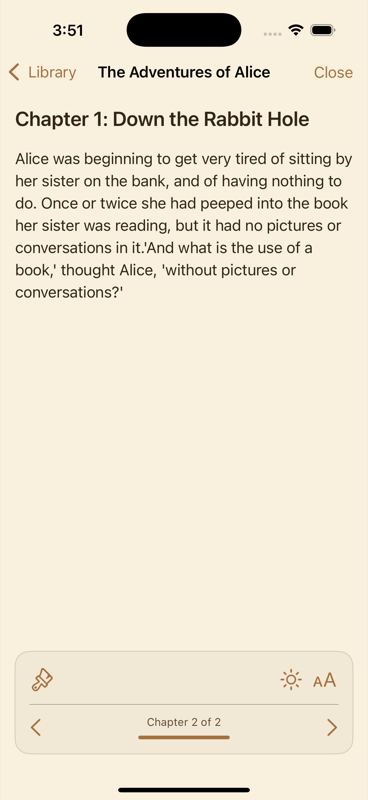

# Dobi - EPUB Reader App

An iOS EPUB reader built with SwiftUI and SwiftData. Features theming, accessibility support, and clean reading.

## Features

### Reading Experience
- EPUB reading interface without distractions
- WebKit text rendering
- Chapter navigation with progress tracking  
- Bookmarks and highlights
- Reading progress saves automatically

### Theming System
- Built-in Themes: Light, Dark, and Sepia modes
- Custom Themes: Create and customize your own color schemes
- SwiftUI Integration: Native iOS component support with preferredColorScheme
- System Integration: Follows iOS light/dark mode
- Scheduled Themes: Switch themes by time
- WCAG Compliance: Check accessibility contrast ratios
- Theme Import/Export: Share custom themes (coming soon)

### Accessibility
- WCAG AA/AAA contrast ratio compliance checking
- SwiftUI accessibility support
- High contrast theme options
- VoiceOver compatible interface

### Data Management
- SwiftData local storage
- Reading progress synchronization
- Book metadata management
- User preferences persistence

## Architecture

### Core Components
- Theme System: Protocol-based theming with SwiftUI integration
- SwiftData Models: Book, Chapter, ReadingProgress, Bookmark, Highlight, Note, UserPreferences
- Theme Manager: Centralized theme management with automatic switching
- Reader Engine: WebKit-based EPUB rendering

### Theme System Details
```swift
protocol Theme {
    var id: String { get }
    var name: String { get }
    var background: Color { get }
    var text: Color { get }
    var accent: Color { get }
    var secondary: Color { get }
    var surface: Color { get }
    var colorScheme: ColorScheme { get } // iOS integration
}
```

## Getting Started

### Requirements
- iOS 17.0+
- Xcode 15.0+
- Swift 5.9+

### Installation
1. Clone the repository
```bash
git clone https://github.com/yourusername/Dobi.git
cd Dobi
```

2. Open in Xcode
```bash
open Dobi.xcodeproj
```

3. Build and run on iOS Simulator or device

### Project Structure
```
Dobi/
├── Models.swift              # SwiftData models
├── Theme.swift               # Theme system implementation
├── ThemeManager.swift        # Theme management logic
├── ThemeSelectionView.swift  # Theme picker UI
├── CustomThemeBuilderView.swift # Custom theme creator
├── ReaderView.swift          # EPUB reading interface
├── ContentView.swift         # Main library view
└── DobiApp.swift            # App entry point
```

## Usage

### Theme Management
```swift
// Create custom theme
let customTheme = themeManager.createCustomTheme(
    name: "My Theme",
    background: .white,
    text: .black,
    accent: .blue,
    secondary: .gray,
    surface: .gray,
    colorScheme: .light
)

// Apply theme
themeManager.selectTheme(customTheme)

// Schedule automatic switching
themeManager.updateScheduleSettings(settings)
```

### Adding Books
Supports sample book creation. Full EPUB import coming soon.

## Development

### Building
```bash
# Build for simulator
xcodebuild -scheme Dobi -destination 'platform=iOS Simulator,name=iPhone 16' build | xcbeautify -q

# Clean build
xcodebuild -scheme Dobi clean build | xcbeautify -q
```

### Code Style
- SwiftUI best practices
- Swift 5.9+ features
- Protocol-oriented design
- MVVM architecture when needed

### Testing
- Unit tests for theme system
- UI tests for reading interface
- Accessibility testing support

## Contributing

1. Fork the repository
2. Create a feature branch (`git checkout -b feature/amazing-feature`)
3. Follow the existing code style and architecture
4. Add tests for new functionality
5. Commit your changes (`git commit -m 'feat: add amazing feature'`)
6. Push to the branch (`git push origin feature/amazing-feature`)
7. Open a Pull Request

### Commit Conventions
Follow conventional commits:
- feat: New features
- fix: Bug fixes
- docs: Documentation changes
- style: Code formatting
- refactor: Code restructuring
- test: Test additions
- chore: Maintenance tasks

## Technical Details

### Theme System Architecture
The theme system uses a protocol-based approach with SwiftUI:

1. Theme Protocol: Defines the interface for all themes
2. Built-in Themes: Light, Dark, and Sepia implementations
3. Custom Themes: User-created themes with full customization
4. Theme Manager: Handles persistence, scheduling, and system integration
5. SwiftUI Integration: Uses preferredColorScheme for iOS appearance

### Key Features
- Automatic Color Scheme Detection: Responds to iOS system appearance changes
- Scheduled Theme Switching: Time-based automatic theme changes
- WCAG Compliance: Built-in accessibility contrast checking
- Theme Persistence: Custom themes saved to UserDefaults
- Animation Support: Smooth transitions between themes

## License

MIT License - see the LICENSE file for details.

Built with SwiftUI